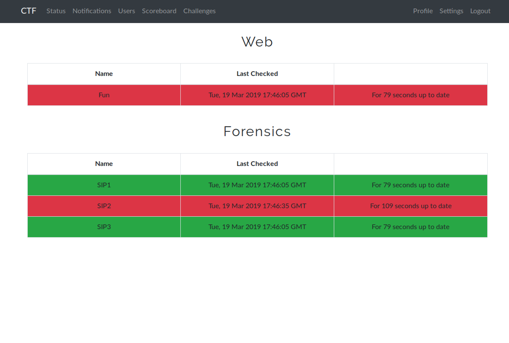
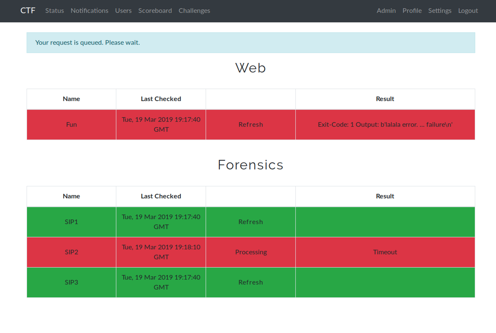

# CTFd-status_checker

CTFd plugin and backend to check availability of CTF challenges.

## Features

- Multithreaded
- Last checked timestamp
- Configurable via config file
- Generic use, just add your exploits and you’re ready to go
- A user can request a status check for each challenge from the plugin view
- Scheduled updates of all challenges
- Admin view with results (error reports)

### User View


### Admin View


## Setup

- Copy `CTFd-status_checker` in your CTFd instance at `<dockerroot>/CTFd/CTFd/plugins/`
- Create a custom `docker-compose.yml` like the provided one in the `Docker` folder
- Copy the status_checker backend (`Docker/status_checker`) to your desired location e.g. `<dockerroot>/status_checker`
- Develop and add your exploits to `<dockerroot>/status_checker/exploits/`. It's important that you add at least one subfolder which will be used as a category.
    - `exploits/AllChallenges/Chall1`, `exploits/AllChallenges/Chall2` or
    - `exploits/Web/Chall1`, `exploits/Web/Chall2`, `exploits/Pwn/Chall3`
- If you create your own `docker-compose.yml` make sure to keep the checker in the internal network of CTFd.
- You may need to adjust the static IP addresses in your compose file, in the CTFd plugin code and in the checker server source code.
- Add missing packages to the backends Dockerfile `Docker/status_checker/Dockerfile`. For example, if you need more python packages for your exploits.

## Example
```
git clone https://github.com/made0x78/CTFd-status_checker.git
cd CTFd-status_checker/Docker
rm -r CTFd
git clone https://github.com/CTFd/CTFd.git
cp -R ../CTFd-status_checker CTFd/CTFd/plugins/
docker-compose build
docker-compose up
```
Register admin account and visit status page.

## Config

- ``timeout``: In seconds for subprocess (executes the exploit)
    - Timeout will be automatically increased on second, third, ... try of execution
- `flag_regex`: Regex for your flags
- `workers`: How many threads to execute exploits of your queue?
- `delay_in_seconds`: Scheduled refresh of all challenges. (default 30 minutes)
- `retries`: How many iterations if an exploit fails? Each iteration will also increase the timeout. (First try: timeout \* 1, Second try: timeout \* 2, ...)
- `up_to_date_interval_in_seconds`: Specifies the interval a current state is valid and a manual refresh is not allowed.

You can also overwrite the `timeout` and `retries` value for each exploit. Just add a file called `config.json` to your exploit folder, e.g. `Docker/status_checker/Forensics/SIP1/config.json`. This can be useful for longer tasks which require brute force.

## Exploit development

- **Always add a shebang!**
    - `#!/bin/bash`
    - `#!/usr/bin/env python`
    - `#!/usr/bin/env python3`
    - ...
- Test your scripts before deploying them! `./exploit.py`
- Each exploit has to return exactly one flag! (regex). If your exploit returns multiple flags the checker will throw an error.
- Examples provided at `Docker/status_checker/exploits/`
